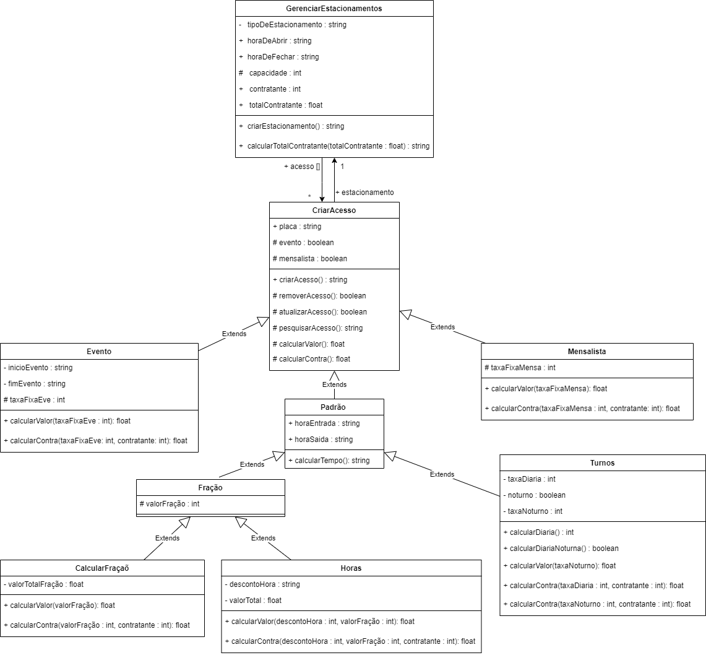

# Diagramas-UML-OO
Trabalho Prático - Entrega 1

<ul> <li> Membros: </li>
<li> Arthur Grandão de Mello </li>
<li> Luis Pedro De Castro Alves </li>
<li> Gabriel Campello Marques</li>
<li> Rafael Ferreira Leandro </li>
</ul>

<b> Diagrama De Classes </b>

<b> Diagrama De Objetos </b>

